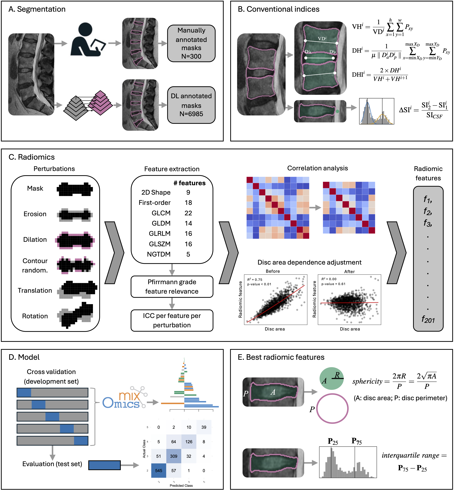

### Extracting conventional IVD features and radiomics from T2-weighted MRI
This is an example of extracting:
- A. Intervertebral disc (IVD) peak signal intensity difference with two normalisation methods.
- B. IVD and vertebral body (VB) conventional geometric indices (e.g. IVD height index).
- C. Full set of Radiomic features from the IVD (shape and texture features) using pyradiomics across a rnage of binwidths and resamplings. 

### Running the example for feature extraction
Set up the environment using pip andrequirements.txt (**NB** pyradiomics may not work on versions of python >3.9) and use run.py to use the script on the sample masks and image. 

This code was used in the following study: [doi.org/10.1101/2025.04.01.25325008](https://doi.org/10.1101/2025.04.01.25325008). Additional scripts for image mask perturbations and statistical analysis used in the paper are in the notebooks folder. 

